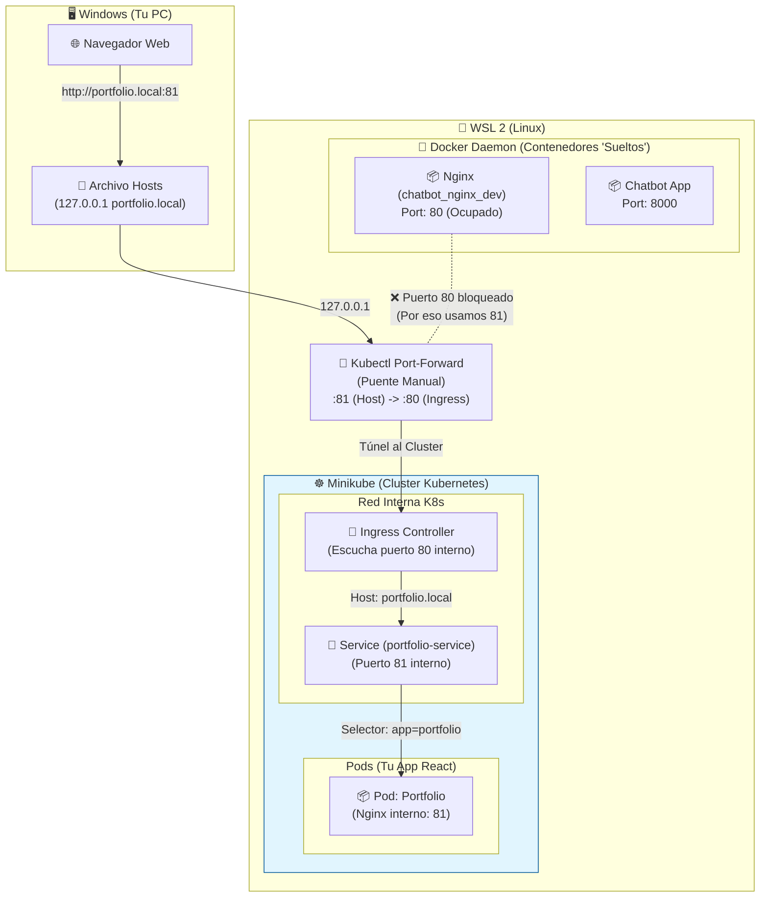

# Arquitectura del Proyecto

Este documento detalla la arquitectura actual del despliegue en local, específicamente diseñada para funcionar en un entorno **WSL 2** (Windows Subsystem for Linux) conviviendo con otros contenedores Docker preexistentes, evitando conflictos de puertos.

## Diagrama de Flujo y Red

## Componentes y Configuración

### 1. Resolución de Nombres (Windows)
*   **Archivo:** `C:\Windows\System32\drivers\etc\hosts`
*   **Configuración:** `127.0.0.1 portfolio.local`
*   **Propósito:** Engañar al navegador para que busque el dominio localmente en lugar de en internet o en la IP de Minikube (que es inaccesible directamente desde Windows en ciertos modos de red).

### 2. El Puente (WSL 2)
*   **Comando:** `sudo kubectl port-forward -n ingress-nginx service/ingress-nginx-controller 81:80 --address 0.0.0.0`
*   **Propósito:** 
    *   Abre el puerto **81** en la máquina WSL (accesible desde Windows como localhost).
    *   Redirige todo ese tráfico al puerto **80** del **Ingress Controller** dentro de Minikube.
    *   Se usa el puerto 81 externamente para no colisionar con el Nginx que ya corre en el puerto 80 del Docker de WSL.

### 3. Kubernetes (Minikube)
*   **Ingress Controller:** Recibe la petición, ve que el host es `portfolio.local` y la enruta al servicio correcto.
*   **Service (`portfolio-service`):** Recibe tráfico del Ingress y lo distribuye a los pods. Funciona en el puerto 81.
*   **Pods (`portfolio-deployment`):** Contenedores Nginx sirviendo la app React compilada. Exponen el puerto 81.

## Por qué esta arquitectura?
1.  **Evita Conflictos:** Permite mantener tus aplicaciones de desarrollo anteriores (`chatbot`, `dog_training`) corriendo en sus puertos habituales (80, 8000) sin interferencia.
2.  **Compatibilidad WSL:** Supera las limitaciones de red de WSL2 donde la IP de Minikube no siempre es visible directamente desde el host de Windows.
3.  **Simulación Realista:** Usa un Ingress Controller real, simulando cómo funcionaría en un entorno de producción en la nube.